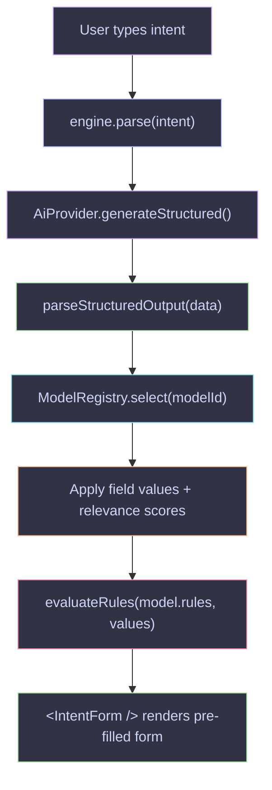

## Steps explained

**1. Intent capture** — `<IntentForm />` renders a text input. The user types a free-form sentence.

**2. AI call** — The engine calls `provider.generateStructured()` with a prompt that includes the model's schema and field list. The provider returns raw JSON plus a confidence score.

**3. Parse output** — `parseStructuredOutput` validates the raw JSON against the model's Zod schema. If validation fails or confidence is below the tier threshold, the engine escalates to the next provider tier.

**4. Model selection** — The AI output includes a `model` field (matched against registered model IDs). If not present, the engine selects the best match by comparing `useCases` to the intent.

**5. Field pre-fill** — Parsed values are mapped to form fields. The `fieldRelevance` map (0–1 per field) lets the UI highlight which fields were inferred vs. left empty.

**6. Rule evaluation** — `evaluateRules(rules, values)` runs all conditional rules against the current values, producing a per-field visibility and required state.

**7. Rendered form** — The adapter (TanStack Form or React Hook Form) initializes with pre-filled values. Rules are re-evaluated on every field change.

## Confidence and escalation

The AI returns a confidence score between 0 and 1. If it falls below a tier's threshold, the engine retries with the next provider. See [Confidence Tiers](./confidence-tiers/).

```typescript
// Simplified escalation logic
if (confidence < tier.threshold) {
  return routeThroughTiers(remainingTiers, providers, input)
}
```
