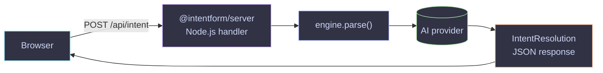
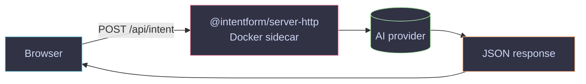

API keys for OpenAI, Anthropic, and Google must never be in browser bundles. IntentForm provides three server-side patterns depending on your stack.

## Pattern 0 — Client-side only (demos only)


The provider is instantiated in the browser with the API key passed directly. Only acceptable for local dev or playgrounds where the key is disposable.

```typescript
// ONLY for demos — key exposed in browser
const engine = createIntentForm({
  provider: openaiProvider({ apiKey: import.meta.env.VITE_OPENAI_API_KEY }),
  models: [...],
})
```

## Pattern A — Node.js backend (`@intentform/server`)

The engine runs on your server. The browser uses `@intentform/client` to POST a prompt string to your endpoint. API key never leaves the server.



Supported server frameworks:

| Framework | Helper | Recipe |
|-----------|--------|--------|
| Hono | `createIntentFormHonoRoute(engine)` | [Hono recipe](../recipes/server-hono/) |
| Next.js App Router | `createIntentFormNextHandler(engine)` | [Next.js recipe](../recipes/server-next/) |
| TanStack Start | `createIntentFormServerFn(engine)` | [TanStack Start recipe](../recipes/server-tanstack-start/) |
| Generic Web Fetch | `createIntentFormRoute(engine)` | see below |

**Generic handler** (Cloudflare Workers, Bun.serve, Deno.serve, etc.):

```typescript
import { createIntentFormRoute } from '@intentform/server'

const handler = createIntentFormRoute(engine)

export default { fetch: handler }
```

**Browser client:**

```typescript
import { createClientIntentForm } from '@intentform/client'

const engine = createClientIntentForm({
  endpoint: '/api/intent',
  models: myModels, // needed client-side for field rendering only
})
```

## Pattern B — Non-Node backend (`@intentform/server-http`)

If your backend is Spring Boot, .NET, Django, or any other non-Node runtime, run `@intentform/server-http` as a sidecar container. Your backend doesn't need to know about AI at all.



See the [HTTP Sidecar recipe](../recipes/server-http-sidecar/) for Docker Compose setup, env vars, and backend integration examples.

## Choosing a pattern

| Situation | Pattern |
|-----------|---------|
| Local dev / playground | 0 (client-side) |
| Node.js backend (Hono, Next, TanStack Start) | A (`@intentform/server`) |
| Serverless / edge (Cloudflare, Vercel Edge) | A (generic Web Fetch handler) |
| Non-Node backend (Spring, .NET, Python) | B (`@intentform/server-http` sidecar) |

## Auth and CORS

When Pattern A or B is exposed to the browser, protect the endpoint:

- **Auth:** set `INTENTFORM_AUTH_TOKEN` (sidecar) or validate a bearer token in your Node handler before calling the engine.
- **CORS:** set `INTENTFORM_CORS_ORIGIN` (sidecar) or configure CORS middleware in your Node framework.
