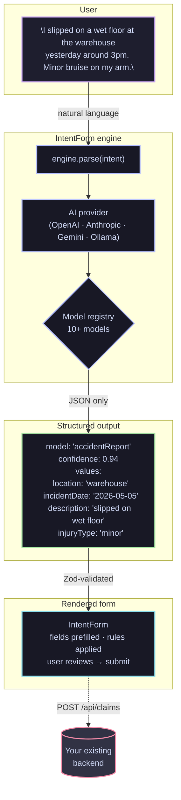

import { Card, CardGrid, LinkCard, Tabs, TabItem } from '@astrojs/starlight/components';

## How it works



<CardGrid>
  <LinkCard
    title="Start in 5 minutes"
    href="./quick-start/"
    description="Install, wire one provider, render IntentForm, ship."
  />
  <LinkCard
    title="Try it live"
    href="./playground/"
    description="Type any intent in the browser, watch the form auto-fill."
  />
</CardGrid>

## Why IntentForm

<CardGrid>
  <Card title="Form-heavy apps drown users" icon="warning">
    Insurance portals, HR systems, government services — users must navigate a menu of form types, pick the correct one, then fill 20 fields from scratch. Most pick the wrong form. Most abandon halfway through.
  </Card>

  <Card title="Chat alone can't replace forms" icon="information">
    A chat transcript can't be validated, routed to a backend endpoint, or stored without a fragile parsing step. Your `POST /api/claims` expects `{ policyNumber, claimType, incidentDate }` — not a paragraph.
  </Card>

  <Card title="Models map 1:1 to your API" icon="puzzle">
    Define one `ModelDefinition` per backend entity. IntentForm's engine resolves intent to the right model and extracts structured values that match your existing schema — no new endpoints, no new storage format.
  </Card>
</CardGrid>

## Get started in 30 seconds

<Tabs>
  <TabItem label="Install">
    ```bash
    pnpm add @intentform/core @intentform/react @intentform/provider-openai zod
    ```
  </TabItem>
  <TabItem label="Wire up">
    ```typescript
    import { createIntentForm } from '@intentform/core'
    import { IntentForm } from '@intentform/react'
    import { openaiProvider } from '@intentform/provider-openai'
    import { accidentReportModel } from './models/accident-report'

    const engine = createIntentForm({
      provider: openaiProvider({ apiKey: process.env.OPENAI_API_KEY! }),
      models: [accidentReportModel],
    })

    export default function App() {
      return <IntentForm engine={engine} />
    }
    ```
  </TabItem>
</Tabs>

## Built for production

<CardGrid>
  <Card title="4 AI providers" icon="star">
    OpenAI, Anthropic, Google Gemini, and Ollama out of the box. Swap or combine with confidence tiers.
  </Card>

  <Card title="2 form adapters" icon="puzzle">
    TanStack Form and React Hook Form. Bring your existing form stack — IntentForm adds intent resolution on top.
  </Card>

  <Card title="Server-side patterns" icon="setting">
    API key never in the browser. Node.js handler or Docker sidecar — your choice, both covered.
  </Card>

  <Card title="Debug panel" icon="information">
    `<IntentFormDebugPanel />` surfaces model selection, field scores, confidence, and provider usage at a glance.
  </Card>
</CardGrid>

## Explore the docs

<CardGrid>
  <LinkCard title="How It Works" href="./concepts/intent-flow/" description="Full engine pipeline explained" />
  <LinkCard title="All Packages" href="./concepts/packages/" description="Overview of every package and when to use it" />
  <LinkCard title="Keep API Key Server-Side" href="./recipes/server-side-key/" description="Production security pattern" />
</CardGrid>
